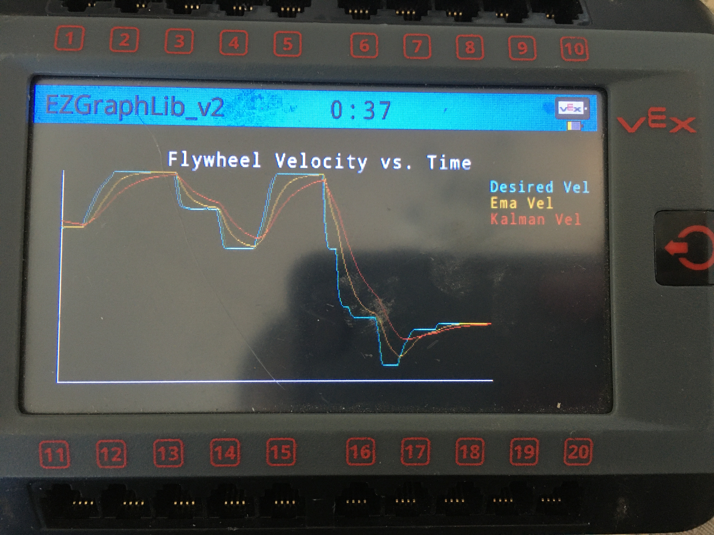

# EZGraphLib

EZGraphLib is an open-source [PROS](https://pros.cs.purdue.edu/) library that simplifies graphing data on the [v5 brain](https://www.vexrobotics.com/276-4810.html). 



## Installation

Use the [PROS CLI](https://github.com/purduesigbots/pros-cli/releases) to install EZGraphLib. If you installed PROS correctly, you should already have the PROS CLI. 

1. Download ``EZGraphLib@LATEST_VERSION.zip`` (found [here](https://github.com/Yessir120/EZGraphLib/releases)) at the root of your project
2. Run ``pros conductor fetch EZGraphLib@LATEST_VERSION.zip`` at the root of your project
3. Run ``pros conductor apply EZGraphLib`` at the root of your project
4. Add ``#include "EZGraphLib/Grapher.hpp"`` to your header file

## Usage

#### Example code: 

```cpp
#include "EZGraphLib/Grapher.hpp"

// Create grapher
std::shared_ptr<graph::AsyncGrapher> grapher(new graph::AsyncGrapher("Flywheel Velocity vs. Time"));

// Add data types
grapher->addDataType("Desired Vel", COLOR_ORANGE);
grapher->addDataType("Actual Vel", COLOR_AQUAMARINE);

// Start grapher task
grapher->startTask();

while(true) {
    // Update data
    grapher->update("Desired Vel", DESIRED_VELOCITY);
    grapher->update("Actual Vel", ACTUAL_VELOCITY);

    pros::delay(10);
}
```

#### Documentation: 

```cpp
/**
 * @brief Construct a new Async Grapher object
 *
 * @param title graph title
 * @param rate refresh rate
 */
AsyncGrapher(const std::string &title, const okapi::QTime &rate = 10 * okapi::millisecond);

/**
 * @brief Add new graph data type
 *
 * @param name data type name
 * @param color line color
 */
void addDataType(const std::string &name, const uint32_t color);

/**
 * @brief Update graph
 *
 * @param name data type name
 * @param val updated data value
 */
void update(const std::string &name, double val);

/**
 * @brief Set the refresh rate
 *
 * @param rate refresh rate
 */
void setRefreshRate(const okapi::QTime &rate);

/**
 * @brief Get the current refresh rate
 *
 * @return refresh rate
 */
okapi::QTime getRefreshRate();
```

## Contributing
Pull requests are welcome. For major changes, please open an issue first to discuss what you would like to change.

## License
[GPL-3.0](https://choosealicense.com/licenses/gpl-3.0/)
